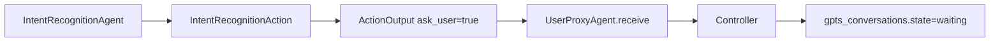
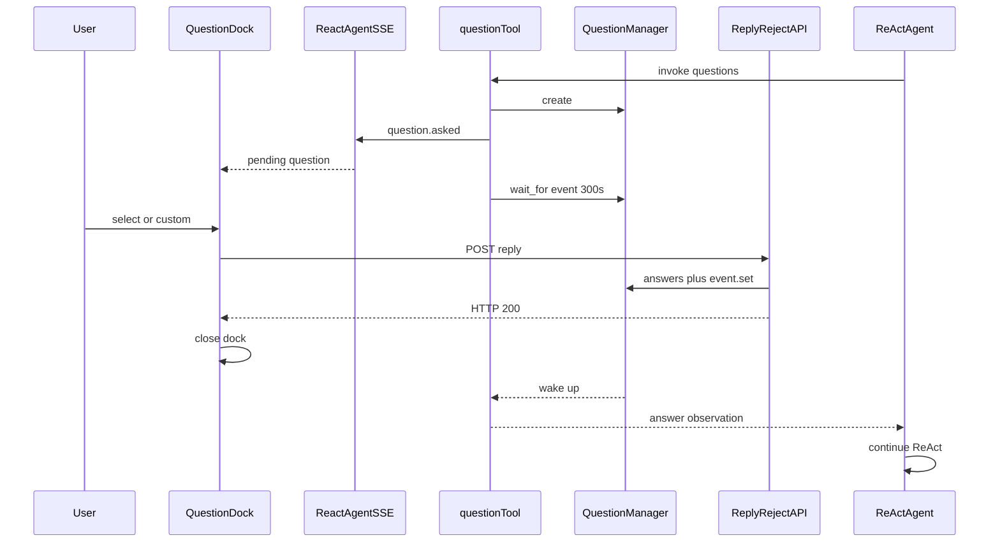
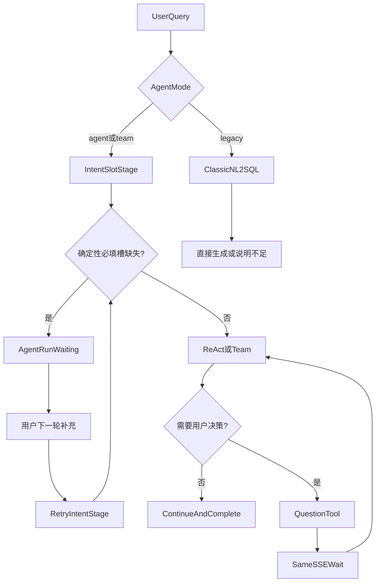

# DB-GPT 模糊问题与 HITL 对标落地方案

## 1. 文档目的

本文基于本地 DB-GPT 源码，给出 Awesome-DB 在模糊问题识别、槽位补全和 Agent 执行中人工介入（Human-in-the-loop，HITL）方面的对标方案。

本文明确区分三类行为：

1. **Intent 槽位补全**：缺少执行所需的确定性信息时，结束当前轮次并进入 `waiting`，等待用户下一轮补充。
2. **Agentic `question` 工具**：Agent 执行过程中遇到开放式决策时，在当前 SSE 请求内暂停，等待用户通过独立 HTTP 接口答复。
3. **Classic NL2SQL**：不强制追问，基于 schema、历史消息和默认限制直接生成 SQL，信息不足时说明原因。

这三类行为在 DB-GPT 中是彼此独立的机制。对标实现不能只增加一个“等待”字段，也不能把所有模糊问题都交给同一种追问方式。

### 1.1 对标原则

- **行为一致**：触发条件、状态转换、恢复方式、工具生命周期和前端交互与 DB-GPT 保持一致。
- **职责分离**：跨请求 `WAITING` 与同请求 `question` 等待不得共用一套状态语义。
- **保留现有能力**：不替换当前 SQLBot 式 `chat_conversation_log` messages 滑动窗口。
- **本地安全增强**：保留 Awesome-DB 的 SSE 心跳，并为 reply/reject 增加用户、工作空间和会话归属校验。
- **分阶段实施**：先建立契约与状态模型，再接 Agent，最后实现 QuestionDock。

### 1.2 非目标

- 不在本方案中重构完整 AutoPlan/AWEL。
- 不移植 DB-GPT 的写操作 `ConfirmationInterceptor`。
- 不为 `legacy` 模式增加 Agentic `question` 工具。
- 首版不引入 LangGraph checkpoint/interrupt。
- 首版不解决多进程共享 `asyncio.Event`；通过部署约束控制。

---

## 2. DB-GPT 源码事实

以下结论来自本地目录 `D:\develop\git-repo\opensource\DB-GPT`，用于区分源码事实与 Awesome-DB 的适配设计。

## 2.1 路径 A：Intent 槽位补全与 WAITING

### 2.1.1 数据输出

DB-GPT 的 Intent 检测结果包含：

```json
{
  "intent": "意图名称",
  "slots": {
    "time_range": "",
    "region": "华东"
  },
  "ask_user": "请补充统计时间范围。",
  "user_input": "补齐槽位后的完整任务描述"
}
```

相关实现：

- `packages/dbgpt-core/src/dbgpt/experimental/intent/base.py`
  - `IntentDetectionResponse`
  - `has_empty_slot()`
- `packages/dbgpt-serve/src/dbgpt_serve/agent/agents/expand/actions/intent_recognition_action.py`
  - `IntentRecognitionInput`
  - `IntentRecognitionAction.run()`

`IntentRecognitionAction.run()` 遍历 `slots`。任一槽位为空时返回：

```python
ActionOutput(
    is_exe_success=False,
    content=<完整 intent JSON>,
    view=intent.ask_user,
    have_retry=False,
    ask_user=True,
)
```

这里有四个关键语义：

- `is_exe_success=False`：本次 Action 未完成业务目标。
- `have_retry=False`：不要让 Agent 自己重试。
- `ask_user=True`：需要外部人类输入。
- `view`：显示给用户的追问文案。

### 2.1.2 ask_user 的传播

相关实现：

- `packages/dbgpt-core/src/dbgpt/agent/core/action/base.py`
  - `ActionOutput.ask_user`
- `packages/dbgpt-core/src/dbgpt/agent/core/user_proxy_agent.py`
  - `UserProxyAgent.receive()`
  - `have_ask_user()`

Agent 回复携带 `action_report` 返回给 `UserProxyAgent`。`UserProxyAgent.receive()` 检测 `action_report.ask_user`，将实例状态 `ask_user=True`。Controller 在本轮结束时读取 `have_ask_user()`。



### 2.1.3 WAITING 的真实归属

DB-GPT 的 WAITING **不属于普通聊天会话**，而属于 Agent 执行轮次：

- 表：`gpts_conversations`
- 模型：`GptsConversationsEntity`
- 字段：`state`
- DAO：`GptsConversationsDao`

状态枚举位于：

- `packages/dbgpt-core/src/dbgpt/agent/core/schema.py`

状态值：

```text
todo
running
waiting
retrying
failed
complete
```

普通用户会话 `StorageConversation` 不承担该状态。一个用户会话可以包含多个已完成的 Agent 子轮次，以及一个正在等待用户的子轮次。

### 2.1.4 下一轮恢复

核心代码位于：

- `packages/dbgpt-serve/src/dbgpt_serve/agent/agents/controller.py`

Controller 读取用户会话下最后一个 `gpts_conversations`：

1. 最后一条不是 `waiting`：生成新的 `agent_conv_id`。
2. 最后一条是 `waiting`：
   - `is_retry_chat=True`
   - 复用原 `agent_conv_id`
   - 从 `gpts_messages` 恢复历史消息
   - 恢复 `message_round`
   - 恢复 `last_speaker_name`
   - 将状态从 `waiting` 改回 `running`
3. Agent 构建时传入 `is_retry_chat=True`。
4. Profile 使用 `retry_goal` / `retry_constraints`。
5. 如果槽位仍不完整，再次进入 `waiting`；否则执行后续任务。

因此，完整恢复依赖：

- Agent 执行轮次状态
- Agent 消息历史
- `action_report`
- 上次发言 Agent
- 当前轮数
- retry prompt

只给 `chat_conversation` 增加一个 `status` 字段不能实现相同行为。

## 2.2 路径 B：Agentic question 工具

### 2.2.1 工具创建方式

相关实现：

- `packages/dbgpt-app/src/dbgpt_app/openapi/api_v1/tools/question.py`
  - `make_question(react_state, stream_callback)`
- `packages/dbgpt-app/src/dbgpt_app/openapi/api_v1/agentic_data_api.py`
  - 每个请求内创建 `stream_queue`
  - 每个请求内创建 `stream_callback`
  - 调用 `make_question(...)`
  - 把结果加入当前请求的 `ToolPack`

`question` 不是无状态全局工具实例，而是一个捕获当前 `react_state` 和 `stream_callback` 的请求级闭包。

工具描述要求：

- 问题、标题、选项和说明必须与用户使用相同语言。
- 支持单选、多选和自定义输入。
- 推荐项放第一位，并在 label 中标记 `(Recommended)`。
- 不要在已启用自定义输入时再增加“其他”选项。

### 2.2.2 QuestionManager

相关实现：

- `packages/dbgpt-app/src/dbgpt_app/openapi/api_v1/tools/question_manager.py`

核心结构：

```python
PendingQuestion(
    request_id: str,
    conv_id: str,
    questions: list[dict],
    event: asyncio.Event,
    answers: list[list[str]] | None,
    rejected: bool,
)
```

模块级单例 `question_manager` 使用 `request_id` 索引 pending：

- `create()`
- `reply()`
- `reject()`
- `remove()`
- `list_pending()`

`conv_id` 仅作为元数据和列表过滤条件；DB-GPT 原实现的 reply/reject 不校验用户或会话归属。

### 2.2.3 同请求等待流程



工具超时为 300 秒：

```text
await asyncio.wait_for(pending.event.wait(), timeout=300)
```

结果语义：

- Reply：向 LLM 返回用户问题与答案组成的 observation，继续执行。
- Reject：返回 “The user dismissed...” observation，继续执行。
- Timeout：发送 `question.rejected`，返回 “Proceeding without user answer” observation，继续执行。
- 所有分支最后删除 pending。

### 2.2.4 SSE 的真实行为

DB-GPT 代码实际行为：

- `question.asked`：工具调用后发送。
- `question.rejected`：仅 300 秒超时时发送。
- `question.replied`：前端类型和 SSE 透传分支存在，但后端没有实际 emit。
- 用户主动 reply/reject：前端根据 HTTP 200 清空 QuestionDock。

因此，严格对标时不能假定正常回答后一定收到 `question.replied`。

### 2.2.5 原生局限

- `QuestionManager` 是进程内字典。
- `asyncio.Event` 只能唤醒创建它的进程和事件循环。
- 多 worker / 多实例下，reply 请求可能被路由到另一个进程而找不到 `request_id`。
- DB-GPT 的 Agentic SSE 没有应用层注释心跳，300 秒等待可能被中间代理断开。
- 页面刷新后没有公开 API 恢复 pending QuestionDock。

这些属于 DB-GPT 源码事实。Awesome-DB 首版可保持同样核心机制，但必须明确部署边界。

## 2.3 路径 C：Classic ChatWithDbExecute

相关实现：

- `packages/dbgpt-app/src/dbgpt_app/scene/chat_db/auto_execute/chat.py`
- `packages/dbgpt-app/src/dbgpt_app/scene/chat_db/auto_execute/prompt.py`
- `packages/dbgpt-app/src/dbgpt_app/scene/chat_db/auto_execute/out_parser.py`

Classic Chat 场景：

- 使用 chat history。
- 根据问题检索相关 schema。
- 生成 SQL 或直接回答。
- schema 不足时说明无法生成。
- 不使用 `UserProxyAgent.ask_user`。
- 不进入 `Status.WAITING`。
- 不挂 `question` 工具。

这条路径对应 Awesome-DB 的 `legacy` 模式。

---

## 3. Awesome-DB 当前实现

## 3.1 教育 pre-flight 澄清

核心文件：

- `src/agent/education/clarification.py`
- `src/chat/service/clarification_gate.py`
- `src/chat/service/conversation_context.py`

当前流程：

1. 读取最新 `ConversationRecord.exec_result` 中的 pending。
2. 若有 pending，将用户回复合并回原问题。
3. 非教育问句且无 pending，直接放行。
4. 教育问句执行意图分类、槽位抽取、历史槽位继承和实体目录对齐。
5. 缺少考试、班级、学校、科目、学生或范围时，发送 SSE `clarify`。
6. 把 `{clarify:true,...}` 写入 `exec_result`。
7. 返回 `halted=True`，当前 SSE 随后发送 `done` 并结束。
8. 用户点击 chip 或输入答案，发起下一次 `chat-stream` 请求。

当前 payload：

```json
{
  "clarify": true,
  "prompt": "要继续分析需要确认考试名称。",
  "missing": ["exam_name"],
  "options": {
    "exam_name": ["2026届高三第一次联考"]
  },
  "filled": {
    "class_name": "高三(1)班"
  },
  "original_question": "分析一下这个班成绩",
  "report_type": "class_overview"
}
```

该实现已经完成“确定性槽位先问再执行”，但与 DB-GPT Intent WAITING 的差异是：

- 澄清发生在 Agent 启动前。
- 没有 Agent 执行轮次实体。
- 没有 `ActionOutput.ask_user`。
- `UserProxyAgent` 只是 sender 标识。
- pending 混在 `exec_result`。
- 下一轮重新启动 pipeline，不是恢复同一 Agent 执行轮次。

## 3.2 多轮 messages 窗口

核心文件：

- `src/chat/service/message_history.py`
- `src/chat/models/conversation.py`
- `src/agent/core/base_agent.py`

当前通过 `chat_conversation_log.messages` 保存 messages 快照，按 human 提问数截取最近 N 轮，并在新 system prompt 后回放。

该能力用于自然语言上下文，不等于 Agent 运行状态恢复：

- messages 能恢复对话内容。
- messages 不能恢复 `last_speaker`、Agent round、ActionOutput 或未完成的 plan。

## 3.3 Agent 与工具执行

核心文件：

- `src/agent/resource/tool/function_tool.py`
- `src/agent/resource/tool/pack.py`
- `src/agent/core/action/tool_action.py`
- `src/agent/core/react_agent.py`
- `src/chat/service/agent_runner.py`

当前工具执行特性：

- async FunctionTool 直接 `await`。
- sync FunctionTool 通过 `asyncio.to_thread` 执行。
- `ToolAction` 等待 ToolPack 返回结果。
- `agent` / `team` 在异步任务中执行。
- `legacy` 整条 pipeline 在线程中执行。

因此，`agent` / `team` 技术上可使用 DB-GPT 式 `asyncio.Event` question 工具；`legacy` 不适合且无需挂载。

## 3.4 LangGraph 和 SSE

- `src/chat/service/team_graph/graph.py` 使用 `graph.compile()`，无 checkpointer。
- TeamState 含运行时复杂对象，不适合直接序列化 checkpoint。
- `src/chat/api/chat.py` 每 15 秒发送 `: keepalive`。
- 前端 abort 目前主要断开 fetch，后端任务通常继续运行。

结论：

- question 工具不需要 LangGraph interrupt。
- 必须保留心跳，避免 300 秒 HITL 等待期间链路超时。
- 需要定义客户端断开时 pending 与 Agent task 的清理策略。

## 3.5 前端现状

核心文件：

- `frontend-react/src/api/adapter/chatAdapter.ts`
- `frontend-react/src/hooks/useChat.ts`
- `frontend-react/src/components/chat/ChatContentContainer.tsx`
- `frontend-react/pages/chat/index.tsx`

当前 `clarify` 事件被转换为消息区的 followup chips；点击后发起新一轮聊天。系统尚无：

- `QuestionDock`
- `question.asked` 类型
- reply/reject API 调用
- 同请求等待状态
- 页面输入区的 HITL 确认面板

---

## 4. 目标架构

## 4.1 三路径决策



确定规则：

- **路径 A**：考试、班级、学校、学生、科目、时间范围等可结构化且执行前必须确定的槽位。
- **路径 B**：指标口径选择、对比维度、图表/报告方向、多个合理方案选择等执行过程中的开放式决策。
- **路径 C**：`legacy`，以及可以安全宽查并返回有限结果的问题。

## 4.2 两套 HITL 生命周期

### Intent WAITING

- 跨 HTTP 请求。
- 当前 SSE 正常结束。
- 状态持久化。
- 用户通过下一轮普通消息恢复。
- UI 使用普通聊天气泡/选项 chip。

### Agentic question

- 同一个 HTTP/SSE 请求。
- Agent 协程在工具内等待 Event。
- pending 首版只在内存。
- 用户通过独立 reply/reject API 唤醒。
- UI 使用输入框上方 QuestionDock。

两者不得共用一个 `waiting` 字段：

- `AgentRun.state=waiting` 表示跨请求 Intent 等待。
- `PendingQuestion` 表示同请求工具等待，不修改 AgentRun 为 waiting。

---

## 5. 路径 A：Intent WAITING 详细设计

## 5.1 数据模型

新增 `chat_agent_run`，对应 DB-GPT `gpts_conversations`：

```sql
CREATE TABLE chat_agent_run (
    id BIGINT GENERATED ALWAYS AS IDENTITY PRIMARY KEY,
    conversation_id BIGINT NOT NULL,
    record_id BIGINT NULL,
    user_id BIGINT NOT NULL,
    workspace_oid BIGINT NOT NULL,
    datasource_id BIGINT NULL,
    run_order INTEGER NOT NULL,
    agent_mode TEXT NOT NULL,
    state TEXT NOT NULL,
    last_speaker TEXT NULL,
    message_round INTEGER NOT NULL DEFAULT 0,
    retry_count INTEGER NOT NULL DEFAULT 0,
    pending_payload JSONB NULL,
    create_time TIMESTAMP NULL,
    update_time TIMESTAMP NULL,
    UNIQUE (conversation_id, run_order)
);
```

状态约束：

```text
todo -> running
running -> waiting
running -> complete
running -> failed
waiting -> running
waiting -> complete
```

新增 `chat_agent_message`，对应 DB-GPT `gpts_messages`：

```sql
CREATE TABLE chat_agent_message (
    id BIGINT GENERATED ALWAYS AS IDENTITY PRIMARY KEY,
    run_id BIGINT NOT NULL,
    round INTEGER NOT NULL,
    sender TEXT NOT NULL,
    receiver TEXT NULL,
    role TEXT NOT NULL,
    content TEXT NULL,
    action_report JSONB NULL,
    context JSONB NULL,
    create_time TIMESTAMP NULL
);
```

不能直接用 `chat_conversation_log` 替代：

- `chat_conversation_log` 是 LLM messages 快照。
- `chat_agent_message` 是 Agent 间消息与 Action 状态。
- 两者可以通过 `record_id` / `run_id` 建立关联，但职责不同。

## 5.2 ActionOutput 和 UserProxy

修改 `ActionOutput`：

```python
class ActionOutput(BaseModel):
    # 现有字段...
    ask_user: bool = False
```

`view` 已存在，继续用于用户可见文案。

扩展 `UserProxyAgent`：

```python
@dataclass
class UserProxyAgent:
    name: str = "user"
    role: str = "User"
    ask_user: bool = False

    def receive(self, message: AgentMessage) -> None:
        report = message.action_report
        if report and report.ask_user:
            self.ask_user = True

    def have_ask_user(self) -> bool:
        return self.ask_user
```

实际实现需匹配当前异步消息发送接口，不能只复制示意代码。

## 5.3 Intent Action

将当前教育规则结果包装为统一 Intent 结果：

```json
{
  "intent": "class_overview",
  "slots": {
    "exam_name": "",
    "class_name": "高三(1)班"
  },
  "ask_user": "请确认考试名称。",
  "user_input": "生成高三(1)班的班级总览"
}
```

规则职责：

- `candidate_missing_slots` 决定必填槽。
- 实体目录 0/N 命中产生 ask_user。
- LLM 只润色问题，不得取消硬槽追问。
- 空槽返回 `ActionOutput(ask_user=True, have_retry=False)`。

短期可保留 `clarification_gate` 作为 Intent Stage 的调用入口；中期将其输出适配到 ActionOutput，使 runner 通过统一 ask_user 链路设置状态。

## 5.4 Runner 行为

新问题：

1. 为当前 conversation 计算 `run_order`。
2. 新建 `chat_agent_run(state=running)`。
3. 执行 Intent Stage。
4. 若 `UserProxy.have_ask_user()`：
   - 持久化 AgentMessage 和 action_report。
   - `chat_agent_run.state=waiting`。
   - 保存 `last_speaker`、`message_round` 和 `pending_payload`。
   - 发送普通追问消息及兼容 `clarify`。
   - 结束当前 SSE。
5. 否则进入正常 `agent` / `team`。

补充回答：

1. 查询当前用户、工作空间、conversation 下最后一个 run。
2. 仅当该 run 为 `waiting` 时进入 retry。
3. 将 run 改为 `running`。
4. `is_retry_chat=True`。
5. 加载 `chat_agent_message`，恢复 `last_speaker` 和 `message_round`。
6. 使用 `retry_goal/retry_constraints`：
   - 保留已确认槽位。
   - 只从本轮补充缺失槽。
   - 用户明确切换问题时终止旧 waiting run 并创建新 run。
7. 槽齐后继续；仍缺则重新 waiting。

## 5.5 与现有 clarify 的兼容

迁移期：

- 后端继续发送现有 `clarify` payload。
- 同时把 payload 存到 `chat_agent_run.pending_payload`。
- `ConversationRecord.exec_result.clarify` 保留一版兼容读取。
- 新读取顺序：`chat_agent_run.pending_payload` 优先，旧 record pending 兜底。
- 数据稳定后再评估移除 `exec_result` pending。

---

## 6. 路径 B：Agentic question 详细设计

## 6.1 Question 数据结构

```python
@dataclass
class PendingQuestion:
    request_id: str
    conv_id: str
    user_id: int
    workspace_oid: int
    questions: list[dict]
    event: asyncio.Event
    answers: list[list[str]] | None = None
    rejected: bool = False
```

相比 DB-GPT 增加 `user_id` 和 `workspace_oid`，用于阻止跨用户抢答。

Question 定义：

```json
{
  "question": "您希望按哪种口径比较？",
  "header": "对比口径",
  "options": [
    {
      "label": "与年级均值比较 (Recommended)",
      "description": "适合班级教学诊断"
    },
    {
      "label": "与全市均值比较",
      "description": "适合学校管理视角"
    }
  ],
  "multiple": false,
  "custom": true
}
```

校验：

- `questions` 至少一项，最多建议三项。
- `header` 最长 30 字。
- 每题至少一个 option，或 `custom=true`。
- option label 同题内唯一。
- `multiple=false` 时 answer 最多一个。
- answer 数组长度必须等于 questions 长度。
- 自定义答案限制长度并做普通文本处理。

## 6.2 请求级工具 factory

新增：

```text
src/agent/resource/tool/question.py
```

接口：

```python
def make_question(
    react_state: dict[str, Any],
    stream_callback: EmitCallback,
    question_manager: QuestionManager,
) -> FunctionTool:
    ...
```

工具必须在每个 chat 请求中创建，不能加入全局模板 ToolPack。推荐流程：

1. `chat_stream` / runner 已创建当前请求的 emit callback。
2. runner 获取当前 request-bound ToolPack。
3. `make_question()` 捕获：
   - `conversation_id`
   - `user_id`
   - `workspace_oid`
   - 当前 emit
4. 把 question tool 合并到该请求 ToolPack。
5. 当前 Agent 完成后释放请求级 pack。

现有 `ToolPack.bind()` 只复制工具字典和 bindings，不适合把闭包工具写入共享模板。需要增加非破坏式组合能力，例如：

```python
request_pack = template_pack.bind(...)
request_pack = request_pack.with_tools([question_tool])
```

`with_tools()` 必须返回新 ToolPack，禁止修改共享模板。

## 6.3 工具执行

伪代码：

```python
async def question(questions: str) -> str:
    parsed = parse_and_validate(questions)
    pending = manager.create(
        conv_id=str(conversation_id),
        user_id=user_id,
        workspace_oid=workspace_oid,
        questions=parsed,
    )
    await emit("question.asked", pending.to_payload())
    try:
        await asyncio.wait_for(pending.event.wait(), timeout=300)
    except asyncio.TimeoutError:
        await emit(
            "question.rejected",
            {"request_id": pending.request_id, "conv_id": pending.conv_id},
        )
        return chunks("Question timed out after 300 seconds. Proceeding without user answer.")
    finally:
        manager.remove(pending.request_id)

    if pending.rejected:
        return chunks("The user dismissed the question. Proceeding without answer.")
    return chunks(format_answers(parsed, pending.answers))
```

实现时注意：Python `finally` 会在 `await` 结束后执行，因此必须在读取 `pending.rejected/answers` 前保留本地对象。删除 manager 字典项不会销毁本地对象。

## 6.4 SSE 协议

`question.asked`：

```text
event: question.asked
data: {"request_id":"que_ab12","conv_id":"123","questions":[...]}
```

Awesome-DB 现有 SSE 使用 `event:` + `data:`；payload 字段与 DB-GPT 保持一致即可，不必改变整个 SSE framing。

超时：

```text
event: question.rejected
data: {"request_id":"que_ab12","conv_id":"123"}
```

正常 reply/reject：

- API 返回 200 后，发起请求的前端立即清 Dock。
- 首版不额外 emit `question.replied`。
- 首版不在用户主动 reject 时 emit `question.rejected`。
- 这样与 DB-GPT 实际行为一致。

等待期间继续由 `chat.py` 每 15 秒发送：

```text
: keepalive
```

## 6.5 Reply / Reject API

Reply：

```http
POST /api/v1/chat/question/{request_id}/reply
Authorization: Bearer ...
Content-Type: application/json

{
  "answers": [
    ["与年级均值比较 (Recommended)"],
    ["数学"]
  ]
}
```

Reject：

```http
POST /api/v1/chat/question/{request_id}/reject
Authorization: Bearer ...
```

成功响应沿用系统统一 response：

```json
{
  "success": true,
  "data": {
    "request_id": "que_ab12"
  }
}
```

服务端校验：

1. request_id 存在且未过期。
2. pending.user_id 等于当前用户。
3. pending.workspace_oid 等于当前工作空间。
4. pending.conv_id 属于当前用户会话。
5. answer 数量、单多选规则合法。
6. 只允许消费一次；重复 reply/reject 返回冲突错误。

建议错误语义：

- 404：pending 不存在或已过期。
- 403：用户/工作空间/会话不匹配。
- 409：已经答复或拒绝。
- 422：答案结构不合法。

## 6.6 前端 QuestionDock

新增：

```text
frontend-react/src/new-components/chat/input/QuestionDock.tsx
```

挂载在 `frontend-react/pages/chat/index.tsx` 的 `ChatInputPanel` 上方。

交互对齐 DB-GPT：

- 标题“需要您的确认”。
- 支持多题。
- 单选使用圆形选择语义。
- 多选使用方形选择语义。
- `custom !== false` 时展示自定义输入。
- 输入自定义内容时清空当前题已选 option。
- 单选 option 时清空当前题自定义内容。
- 每题都有有效答案时才允许 Confirm。
- Confirm 调 reply API；HTTP 成功后清 Dock。
- Cancel / X 调 reject API；HTTP 成功后清 Dock。
- 超时收到 `question.rejected` 后清 Dock。
- question 区最大高度 320px，溢出滚动。

状态建议位于 `useChat.ts`：

```ts
pendingQuestion?: {
  request_id: string;
  conv_id: string;
  questions: QuestionInfo[];
}
```

同一 chat 首版只允许一个 active pending Question。收到新的 `question.asked` 时替换旧值并记录告警。

---

## 7. Prompt 与触发边界

## 7.1 Intent WAITING 的触发

规则硬判：

- 缺考试专名且报告需要单场考试。
- 缺班级且用户权限包含多个可选班。
- 班级名在多个学校下重名。
- 实体目录 0 命中或 N 命中。
- 学科诊断缺科目。
- 学生画像缺学生标识。

这些信息必须在查询前确定，不能让 Agent 用 question 工具拖到执行中再问。

## 7.2 question 工具的触发

系统提示应写明：

- 当存在多个都合理、且不能从权限、历史或 schema 推断的执行方向时使用。
- 当用户偏好会显著影响报告内容或分析成本时使用。
- 每次集中提出最少必要问题，避免逐题反复中断。
- 能安全采用明确默认值时不要问。
- 不要用 question 询问可由数据库/schema/tool 获取的信息。
- 不要询问敏感信息或要求用户绕过权限。

适合：

- “做个对比分析”但校际、班际、历次三种口径均合理。
- “生成报告”但管理视角与教师视角会显著改变内容。
- 用户要求“重点分析问题”，但薄弱学科与临界生两个方向成本较高。

不适合：

- 缺考试、班级等硬槽：走 Intent。
- 表结构未知：先用 schema / sample tools。
- SQL 执行失败：走重试与错误回灌。
- legacy 查询：直接生成或说明不足。

## 7.3 Classic NL2SQL

`legacy` 保持：

- 使用 messages history。
- 使用 schema、术语和训练示例。
- 使用上一轮 SQL 错误回灌。
- 条件不全时生成安全有限的查询，或返回无法生成原因。
- 不创建 AgentRun WAITING。
- 不挂 question。

---

## 8. 模式接入

## 8.1 agent

```text
创建/恢复 AgentRun
  -> Intent Stage
  -> waiting 或继续
  -> 创建 request question tool
  -> DataAnalyst ReAct
  -> complete/failed
```

## 8.2 team

```text
创建/恢复 AgentRun
  -> Intent Stage
  -> waiting 或继续
  -> 创建 request question tool
  -> Planner
  -> DataAnalyst / ToolExpert 可调用 question
  -> Charter
  -> Summarizer
  -> complete/failed
```

首版约束：

- Planner 与执行 Agent 共享同一个 request-bound QuestionManager。
- 同一时刻仅允许一个 pending question。
- question 等待时 LangGraph `ainvoke` 未结束，但不需要 checkpoint。
- question 返回 observation 后，从当前节点继续。

## 8.3 legacy

不做任何 HITL 工具接入。为严格对齐 DB-GPT Classic，目标态关闭 `legacy` 的教育 pre-flight 强制澄清，只允许 `agent` / `team` 进入 Intent Stage。

这会改变当前三模式共用 `clarification_gate` 的行为，实施前必须用回归测试锁定预期。

---

## 9. 安全、并发和生命周期

## 9.1 鉴权

新增 API 必须验证：

- JWT 用户。
- workspace oid。
- conversation 归属。
- datasource 与 conversation 一致。
- pending question 归属。

还应补齐 `chat-stream` 对 `conversation_id` 的归属校验，避免用户向他人会话写 record。

## 9.2 并发

QuestionManager 需要同步保护：

- 同一 request_id 原子创建。
- reply/reject 原子消费。
- remove 幂等。
- 同一 conversation 仅允许一个 active pending。

在单事件循环中普通 dict 足够完成 DB-GPT 对标；若存在后台线程调用，应使用 loop-safe 唤醒。

## 9.3 多 worker 部署

首版约束：

```text
UVICORN_WORKERS=1
```

或使用基于 conversation/request_id 的 sticky routing。

升级到多 worker 前，应把 pending 元数据放入 Redis，并用 Pub/Sub 或 Streams 将 reply 信号发送到持有 Event 的 worker。数据库轮询不适合低延迟同流恢复。

## 9.4 超时与断连

- question timeout：300 秒，与 DB-GPT 一致。
- SSE 心跳：15 秒，保留现有实现。
- 浏览器断连：
  - agent task 应收到 cancel；
  - manager 清除 pending；
  - Dock reply API 返回 404；
  - AgentRun 记录为 failed/cancelled（若增加 cancelled 状态则需同步状态枚举）。
- 首版若暂不实现断连取消，文档和监控必须标明后端任务仍会继续到 timeout。

## 9.5 审计与隐私

记录：

- question request_id
- conversation/run
- 问题 header
- option labels
- reply/reject/timeout
- 耗时

不记录：

- 无必要的完整敏感自由文本
- 超出当前用户权限的候选学校/班级

审计日志不得替代 Agent message 持久化。

---

## 10. 分阶段实施计划

## Phase 0：基线与契约

目标：在改行为前锁定现有功能。

工作项：

- 固化教育 clarify 的应问/不应问用例。
- 固化 messages 滑动窗口。
- 固化 legacy 不使用 Agent 工具。
- 为 `question.asked`、reply/reject response 建 schema fixture。
- 建立状态转换单测。

验收：

- 当前测试全部通过。
- 新契约 fixture 可被后端和前端共享理解。

## Phase 1：Intent WAITING

目标：实现 DB-GPT 式跨请求 Agent run 恢复。

工作项：

- 新增 `chat_agent_run` / `chat_agent_message` 模型、CRUD、迁移。
- `ActionOutput` 增加 `ask_user`。
- 扩展 `UserProxyAgent`。
- 将教育槽位结果适配为 Intent ActionOutput。
- runner 创建/恢复 run。
- 增加 `is_retry_chat`、`last_speaker`、`message_round` 传递。
- Profile 支持 `retry_goal/retry_constraints`。
- 兼容读取旧 `exec_result.clarify`。

验收：

- 缺槽后 run 为 waiting。
- 用户补充后复用同一 run id。
- 已填槽不会被普通补充覆盖。
- 用户切换问题时旧 run 变 complete，新建 run。
- 服务重启后仍可从数据库恢复 waiting。

## Phase 2：Agentic question

目标：实现 DB-GPT 式同请求 Event HITL。

工作项：

- 新增 QuestionManager。
- 新增 request-bound `make_question`。
- ToolPack 增加不可变 `with_tools()`。
- agent/team runner 动态注入。
- 添加 reply/reject API。
- 保留 300 秒 timeout 和 DB-GPT observation shape。
- 加入归属校验。

验收：

- Agent 调 question 后 SSE 保持打开。
- reply 后 ReAct 在同一请求继续。
- reject 后无答案继续。
- timeout 发 `question.rejected` 后继续。
- 两个会话并发互不唤醒。

## Phase 3：QuestionDock

目标：完成用户交互闭环。

工作项：

- 新增类型与 SSE 分支。
- 新增 QuestionDock。
- useChat 保存 pending。
- 页面输入区挂载。
- reply/reject HTTP 成功后清理。
- timeout SSE 清理。

验收：

- 单选、多选、自定义输入符合 DB-GPT。
- 每题未回答时不能提交。
- Cancel 和 X 行为一致。
- 中文问题保持中文。
- Dock 不影响旧 clarify chips。

## Phase 4：可靠性与安全

目标：满足生产运行要求。

工作项：

- 补 conversation/datasource/workspace 归属校验。
- 断连取消和 pending 清理。
- 审计事件。
- 并发冲突与重复提交处理。
- 指标与告警。
- 多 worker 演进设计。

验收：

- 非所属用户无法 reply/reject。
- 过期 request_id 不可消费。
- SSE 中断后无永久 pending。
- 单 worker 部署约束进入部署文档。

---

## 11. 逐文件改造清单

### 后端

| 文件 | 改造 |
|---|---|
| `src/chat/models/agent_run.py` | 新增 AgentRun / AgentMessage |
| `src/chat/models/conversation.py` | 增加关联或统一导出 |
| `alembic/versions/*_chat_agent_run.py` | 新表和索引 |
| `src/chat/crud/chat.py` | run/message CRUD、waiting 查询 |
| `src/agent/core/action/base.py` | 增加 `ask_user` |
| `src/agent/expand/user_proxy.py` | `receive()` / `have_ask_user()` |
| `src/agent/core/profile.py` | retry goal / constraints |
| `src/chat/service/clarification_gate.py` | 适配 Intent ActionOutput 与旧 pending |
| `src/chat/service/agent_runner.py` | create/resume run、request tool 注入、状态终结 |
| `src/chat/service/question_manager.py` | PendingQuestion 生命周期 |
| `src/agent/resource/tool/question.py` | `make_question` |
| `src/agent/resource/tool/pack.py` | 不可变 `with_tools()` |
| `src/chat/api/question.py` | reply/reject router |
| `src/common/router.py` | 注册 question router |
| `src/chat/api/chat.py` | SSE 事件透传、归属校验、断连清理 |

### 前端

| 文件 | 改造 |
|---|---|
| `frontend-react/src/api/adapter/chatAdapter.ts` | Question 类型、SSE、reply/reject |
| `frontend-react/src/hooks/useChat.ts` | pendingQuestion 状态 |
| `frontend-react/src/new-components/chat/input/QuestionDock.tsx` | 新交互组件 |
| `frontend-react/pages/chat/index.tsx` | 输入框上方挂载 |
| `frontend-react/src/components/chat/ChatContentContainer.tsx` | 保持旧 clarify 兼容 |

### 测试

| 目录 | 覆盖 |
|---|---|
| `tests/agent/test_clarification_slots.py` | 硬槽矩阵回归 |
| `tests/chat/test_agent_run.py` | WAITING 状态与恢复 |
| `tests/chat/test_question_manager.py` | create/reply/reject/timeout/concurrency |
| `tests/chat/test_question_api.py` | 鉴权与 answer 校验 |
| `tests/agent/test_question_tool.py` | observation 与 SSE |
| 前端测试 | QuestionDock 单多选、自定义、提交和取消 |

---

## 12. 测试矩阵

### Intent

| 场景 | 预期 |
|---|---|
| 班级总览缺考试 | waiting，追问考试 |
| 老师仅绑定一个班 | 自动填班，不追问班 |
| 老师绑定多个班 | waiting，追问班 |
| 同名班级跨学校 | waiting，追问学校 |
| 目录唯一命中 | 规范化后继续 |
| 目录零命中 | waiting，提供候选 |
| 用户补充缺槽 | 同 run 恢复 |
| 用户明确换问题 | 关闭旧 run，创建新 run |

### Agentic question

| 场景 | 预期 |
|---|---|
| 单选回复 | 返回一个 label |
| 多选回复 | 返回多个 labels |
| 自定义回复 | 返回自由文本数组 |
| 用户 reject | Agent 无答案继续 |
| 300 秒超时 | SSE rejected，Agent 继续 |
| 重复 reply | 409 |
| 错误用户 reply | 403 |
| 错误 workspace | 403 |
| request_id 不存在 | 404 |
| 两会话并发 | Event 隔离 |

### 模式

| 模式 | Intent WAITING | question 工具 |
|---|---:|---:|
| `agent` | 是 | 是 |
| `team` | 是 | 是 |
| `legacy` | 否 | 否 |

---

## 13. 可观测性

建议指标：

```text
hitl_intent_waiting_total{slot,mode}
hitl_intent_resume_total{slot,mode}
hitl_question_asked_total{mode,agent}
hitl_question_replied_total{mode,agent}
hitl_question_rejected_total{reason}
hitl_question_wait_seconds
hitl_question_pending_current
hitl_question_api_forbidden_total
```

建议日志字段：

```text
trace_id
conversation_id
agent_run_id
request_id
user_id
workspace_oid
agent_mode
slot
event
elapsed_ms
```

禁止把完整学生姓名、未经脱敏的自由文本答案写入普通 info 日志。

---

## 14. 风险与决策

| 风险 | 决策 |
|---|---|
| 把聊天会话状态当 Agent run 状态 | 新建 `chat_agent_run` |
| messages history 无法恢复 Agent | 新建 `chat_agent_message` |
| question 工具污染共享 ToolPack | 请求内 factory + 不可变 pack |
| 多 worker 无法唤醒 Event | 首版单 worker，后续 Redis |
| 300 秒期间代理断流 | 保留 15 秒 SSE 心跳 |
| 客户端断连后任务继续 | Phase 4 增加 cancel/cleanup |
| 两套 HITL 语义混淆 | WAITING 与 PendingQuestion 分离 |
| 伪造不存在的 replied SSE | 正常答复由 HTTP 200 清 Dock |
| legacy 过度追问 | legacy 不接两套 HITL |

---

## 15. 完成定义

整体对标完成需同时满足：

1. Intent 空槽可通过 `ActionOutput.ask_user` 传播至 UserProxy。
2. Agent 执行轮次持久化为 `waiting`，服务重启后可恢复。
3. 下一轮补充复用原 run，并使用 retry prompt。
4. agent/team 可在 ReAct 中调用 request-bound question。
5. QuestionDock 在同一 SSE 未结束时提交答案并继续 Agent。
6. reply/reject/timeout 行为与 DB-GPT 源码一致。
7. legacy 不使用 WAITING 或 question。
8. 用户、工作空间、会话和数据源归属校验完整。
9. 所有测试矩阵通过。
10. SSE 心跳、超时、断连和单 worker 部署约束有文档与监控。

---

## 16. 源码索引

### DB-GPT

- `D:\develop\git-repo\opensource\DB-GPT\packages\dbgpt-core\src\dbgpt\experimental\intent\base.py`
- `D:\develop\git-repo\opensource\DB-GPT\packages\dbgpt-serve\src\dbgpt_serve\agent\agents\expand\intent_recognition_agent.py`
- `D:\develop\git-repo\opensource\DB-GPT\packages\dbgpt-serve\src\dbgpt_serve\agent\agents\expand\actions\intent_recognition_action.py`
- `D:\develop\git-repo\opensource\DB-GPT\packages\dbgpt-core\src\dbgpt\agent\core\action\base.py`
- `D:\develop\git-repo\opensource\DB-GPT\packages\dbgpt-core\src\dbgpt\agent\core\user_proxy_agent.py`
- `D:\develop\git-repo\opensource\DB-GPT\packages\dbgpt-serve\src\dbgpt_serve\agent\agents\controller.py`
- `D:\develop\git-repo\opensource\DB-GPT\packages\dbgpt-app\src\dbgpt_app\openapi\api_v1\tools\question.py`
- `D:\develop\git-repo\opensource\DB-GPT\packages\dbgpt-app\src\dbgpt_app\openapi\api_v1\tools\question_manager.py`
- `D:\develop\git-repo\opensource\DB-GPT\packages\dbgpt-app\src\dbgpt_app\openapi\api_v1\agentic_data_api.py`
- `D:\develop\git-repo\opensource\DB-GPT\web\new-components\chat\content\QuestionDock.tsx`
- `D:\develop\git-repo\opensource\DB-GPT\web\utils\react-sse-parser.ts`

### Awesome-DB

- `src/agent/education/clarification.py`
- `src/chat/service/clarification_gate.py`
- `src/chat/service/conversation_context.py`
- `src/chat/service/message_history.py`
- `src/chat/service/agent_runner.py`
- `src/agent/core/action/base.py`
- `src/agent/expand/user_proxy.py`
- `src/agent/resource/tool/pack.py`
- `src/agent/resource/tool/function_tool.py`
- `src/chat/service/team_graph/graph.py`
- `src/chat/models/conversation.py`
- `src/chat/api/chat.py`
- `frontend-react/src/api/adapter/chatAdapter.ts`
- `frontend-react/src/hooks/useChat.ts`
- `frontend-react/pages/chat/index.tsx`

---

## 17. 三方策略总结

| 系统/路径 | 模糊问题策略 | 是否等待用户 |
|---|---|---|
| SQLBot | 检索增强、messages 历史、直接生成 | 否 |
| DB-GPT Classic | schema/history、直接 SQL 或说明不足 | 否 |
| DB-GPT Intent | 空槽、ask_user、run WAITING | 跨请求等待 |
| DB-GPT Agentic | question 工具、Event | 同请求等待 |
| Awesome-DB 当前教育 | pre-flight clarify、record pending | 下一轮重跑 |
| Awesome-DB 目标 | Intent WAITING + Agentic question + Classic | 按场景分流 |

最终目标不是“所有模糊问题都追问”，而是让系统能区分：

- **必须明确后才能执行的信息**；
- **执行过程中需要用户做出的选择**；
- **可以安全采用默认值并直接查询的信息**。

只有这种分层，才能既避免教育场景瞎猜范围，又不让普通问数变成连续的确认对话。
